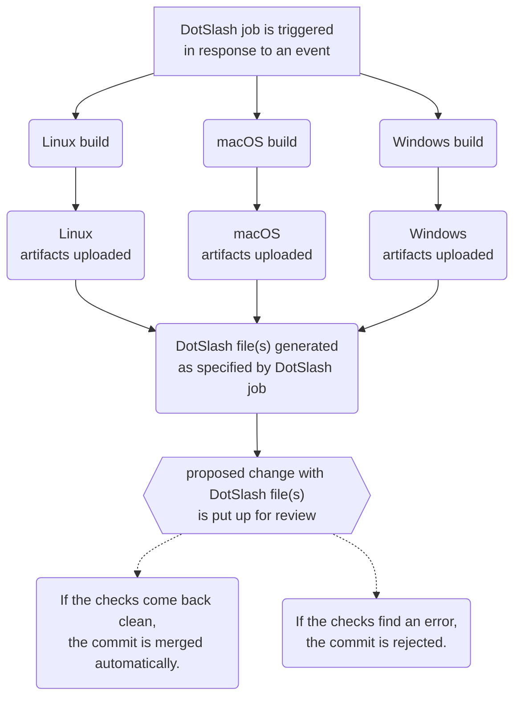

# Motivation

DotSlash is primarily used as an ad-hoc distribution mechanism for tools,
particularly tools that need to be updated atomically with code. At Meta,
DotSlash files are meant to live in source control, often to make the underlying
executables available to developers working within the repository. Though for
CLIs that are designed to be globally available within the company, we also
publish DotSlash files to a repository with a
[Chef recipe](https://docs.chef.io/recipes/) that will sync the vendored
DotSlash files with every developer's `/usr/local/bin/` folder.

Whereas the executables launched by DotSlash are often on the order of megabytes
or even gigabytes, the accompanying DotSlash file is often only a kilobyte or
two. For use cases such as a large monorepo or a heavily populated
`/usr/local/bin/` where the number of executables used by the developer is a
fraction of what is available, the lazy fetching employed by DotSlash
significantly reduces the amount of data being downloaded. This helps ensure
that source control checkouts and Chef runs stay fast with high reliability.

## More DotSlash, Less Docker

At Meta, we use [Buck2](https://buck2.build/) as our build system, and one of
its key design principles is being
[remote execution first](https://buck2.build/docs/why/). That is, Buck2 expects
the computation defined by a build rule to be performed on a remote host,
ideally in some sort of hermetic container. This is done to ensure build
reproducibility as well as to facilitate parallelizing build operations across
your available hardware.

Because Buck2 and its complementary remote execution cluster is used to build
for all sorts of environments (Web, Mobile, VR, Desktop), there is a wide array
of tools to draw from for an individual remote execution invocation. Trying to
create a custom Docker container with "just the right set of tools" and ensuring
each is paired with the proper build job would be extremely difficult to manage.

By comparison, DotSlash makes it possible for developers to "self-serve," as
they can introduce a new tool simply by committing an appropriate DotSlash file
to the repo. Because DotSlash will lazily fetch the corresponding artifact "on
demand" when executed in a remote execution container, there is no need to build
and release a custom container for the remote execution cluster with the new
tool.

That said, you do not want your "hermetic" build container to be able to make
arbitrary HTTP GET requests. Admittedly, this is at odds with how DotSlash
fetches artifacts. At Meta, we address this by writing DotSlash artifacts
directly into the content-addressable storage (CAS) used by our remote execution
cluster and writing special identifiers into the DotSlash file that our internal
fork of DotSlash can use to read from the CAS.

## Generating DotSlash Files at Meta

Because executing a DotSlash file could "run anything," the provenance of a
DotSlash file is paramount. At Meta, the overwhelming majority of our DotSlash
files are created by our Continuous Integration (CI) system. As part of the
public release of DotSlash, we provide a set of [GitHub Actions](../github/)
that you can use to create a comparable release process. The general workflow is
as follows:

- Every DotSlash file in the repository has a policy that determines when it
  should be regenerated. Available criteria include:
  - periodic rebuilds based on a schedule (i.e., `cron`)
  - file changes within a prescribed set of folders
  - manual trigger
- When the criteria is satisfied, a script [that also lives in source control]
  specified by the policy is run, the output of which defines the one or more
  build jobs required to produce the artifacts that will be delivered by
  DotSlash.
  - Each build job is associated with one or more keys in the `"platforms"`
    section of the ultimate [DotSlash file](../dotslash-file/).
  - Note that while the script that generates the jobs could be dynamic, in
    practice, it likely outputs a static configuration defined in the script.
- For each build job:
  - The host does a repository checkout using the same commit that was used to
    run the script that generated the build jobs.
  - The build execution logic is run and whatever file is written to the path
    designated as the "final output" of the build job is compressed using
    [`zstd`](https://facebook.github.io/zstd/) and then uploaded to a blobstore.
    The URL to the blobstore entry, as well as the
    [BLAKE3 hash](<https://en.wikipedia.org/wiki/BLAKE_(hash_function)#BLAKE3>)
    and file size of the compressed artifact, are retained.
- Once all of the build jobs are complete, the metadata across the build jobs is
  aggregated to produce a single DotSlash file with all of the `"platforms"`
  entries. Because DotSlash will ignore any fields that are not part of its
  [recognized schema](../dotslash-file/), our system at Meta also includes a
  structured `"build_info"` property in the DotSlash JSON, which includes fields
  such as `"commit_hash"` and `"commit_date"`. This is primarily for convenience
  when auditing a DotSlash file.
- A new commit is created that contains only the DotSlash file (or possibly
  multiple DotSlash files, if it is a more advanced configuration). This commit
  is put up for review, which has the side-effect of triggering any CI jobs that
  are affected by this change.
- If all of the CI jobs succeed, the commit is automatically pushed to the
  repository. By default, it is pushed to the main branch, though this is
  configurable.

This system ensures that DotSlash files are regenerated regularly without human
intervention and that the build artifacts delivered by DotSlash were produced in
a proper build environment that should be free from human tampering.
