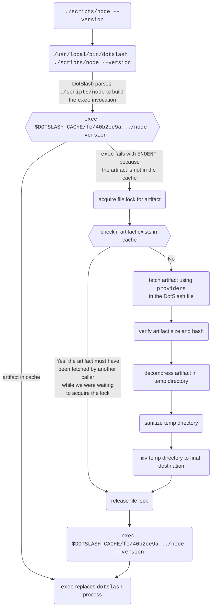

# How DotSlash Works

Here is a flowchart that demonstrates what happens when a user invokes
`./scripts/node --version` on the command line when `./scripts/node` is a
DotSlash file. Note this is what happens on Mac and Linux, as the behavior on
[Windows](../windows) is slightly different.

